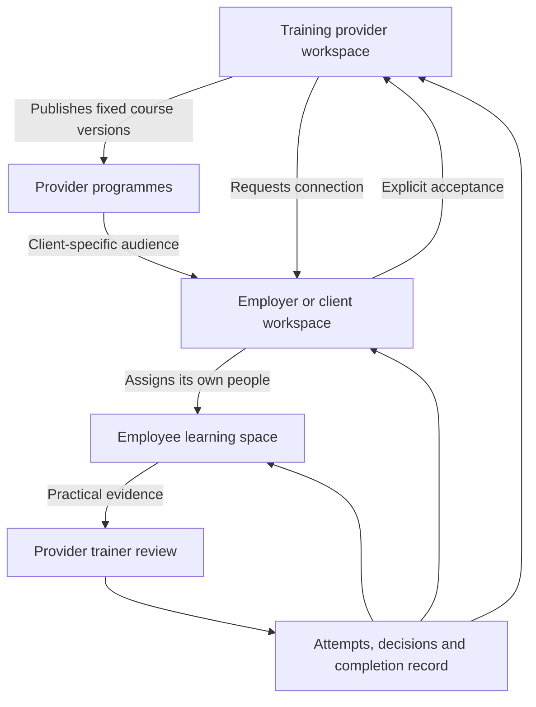

# Experrt learning platform: implementation and next steps

Updated 9 September 2026. This document supersedes the earlier proposal's feature status. The product remains platform-first, supported by Experrt's academy, consulting and training delivery.

## Implemented in this workspace

| Experience | Working behaviour | Entry |
| --- | --- | --- |
| Public learning check | No account, email or payment required. Subject selection, optional robotics, immediate transparent self-report scores, revise answers, session restoration and downloadable snapshot. | `/assessment/start` |
| Learning home | Different learner and manager experiences. Managers can switch between their own learning, internal workforce and client delivery. Counts come from records. | `/dashboard/learning` |
| Learning studio | Create and edit courses with lessons, formative quizzes, practical challenges and observed activities. Draft revisions, validation, optimistic edit conflicts and fixed published versions. | `/dashboard/studio` |
| Programmes | Assemble published course versions, set an audience workspace and target date, assign actual workspace members, inspect completion and archive delivery. Client managers can assign their own people to their provider's programme. | `/dashboard/programmes` |
| Learning player | Assigned content, server-marked formative checks, written practical submissions, trainer feedback, progress, completion date and attempt history. Learners never receive quiz answer keys. | `/dashboard/learn/[assignment]` |
| Records and reviews | Trainer review queue, criteria, observed conditions, feedback, completion search/filter, CSV export and detailed immutable attempt history. | `/dashboard/records` |
| Client workspaces | Provider requests connection using an employer's workspace code. Employer accepts before roster sharing and new programme delivery. Either side can disconnect. Previous programme records remain available. | `/dashboard/clients` |
| Agent work | Persisted goal queue, scoped record-reading tools, course/programme proposals, delivery recommendations, manager approval, cancellation, execution leases, retry limits, usage metering and budget checks. | `/dashboard/agents` |
| Visual identity | Marketing header logo reused in footer. Colourful learning interface, abstract graphics, responsive cards, motion with reduced-motion support, clear labels and intentional empty states. | Marketing and learning workspace |

The existing production OpenAI key was found in this project's linked Vercel environment and connected to the ignored local environment file without displaying it. Live OpenAI verification now passes: a course proposal is persisted for review, and contextual chat reads the current programme's authorised records before answering. Node's connection-family attempt timeout was increased to 2 seconds through server instrumentation after a targeted connectivity check identified the runtime issue. Agents remain manager-initiated. Task execution now continues after the HTTP response using Next.js after; a durable scheduler is still a future milestone.

The everyday interface now has four manager destinations: Home, Learning, People and Records. Learners see My learning, Live sessions and My record. Supporting tools are grouped under Resources. The duplicated global workspace tabs have been removed; only the Learning area has course/programme/session/assessment navigation. Ask Experrt opens a contextual companion alongside the current page; Activity holds delegated tasks and approvals. Conversations use the existing persisted chat system and metering. The companion can read the current authorised lesson, course or programme, while longer tasks create proposals through the existing checked LMS commands.

The companion now renders Markdown headings, lists, emphasis, code and tables, with raw HTML disabled. Explicit course, programme and delivery requests can invoke a manager-only tool that creates a persisted task and runs the existing learning agent. Tool results show progress, failures and an Activity review link. Each request can start at most one task; the existing execution permission, rate, budget and credit checks still apply. This integration passed a live companion-to-background-task-to-review check in an isolated workspace. Approving the same proposal twice produced one draft and no published version. Shared learning artwork and the homepage image use a black overlay behind white text.

A personal transcript now combines native programme records with live enrolments and issued/revoked certificates. It supports format filters, search and a spreadsheet-safe CSV export. It does not invent new certificates or merge different credential rules.

Public assessment answers stay in the current browser session and can be downloaded. They are not automatically uploaded to an employer or added to the signed-in assessment record. Existing assessment campaigns continue to provide organisation-linked responses.

## Cascading tenancy and responsibility

An employer can also author and deliver its own programmes directly. Experrt's training business can use both models in the same workspace. Each client connection is explicit; connecting one client never gives a provider access to another client's roster. An accepted provider sees client workforce names and identifiers, not unrelated client courses or programmes. Provider trainers review provider-owned practical activities; client managers manage their workforce and can inspect evidence for their assignments.

This implementation uses the existing single primary organisation and role per account, with explicit provider/client relationships layered on top. It is not an arbitrary-depth tenant hierarchy or a multiple-employer identity system. Department-level manager scoping and delegated external assessor roles for native LMS activities are future work. Existing live-cohort facilitator permissions remain separate.

## Record and agent architecture

- `lms_courses` holds the editable draft; `lms_course_versions` holds immutable published snapshots through the application command interface.
- `lms_programmes` binds a set of published version IDs to one audience. Assignments reference actual people, never an AI-generated roster.
- `lms_activity_progress` is the current projection. `lms_attempt_history` preserves submissions and trainer decisions. `lms_events` records actions and idempotency keys.
- `lms_clients` records explicit workspace connections. `lms_workspace_settings` stores identity and operating model preferences.
- `lms_agent_runs` persists task state, proposal, outcome and execution lease. A bounded AI SDK ToolLoopAgent reads authorised records and prepares a proposal. Approval invokes the same checked commands as manual creation. Course approval creates a draft, never a published course; programme approval never assigns people automatically.
- All LMS tables have RLS enabled and direct browser table access revoked. Only service-side APIs invoke `lms_command`; the API derives the actor from the authenticated session. Learners cannot supply their actor identity, grades or answer keys.
- A profile trigger prevents browser updates from changing roles, organisation membership, billing overrides or authorisation email. Existing authorised server administration and super-admin workspace switching remain available.
- Mutation request IDs prevent duplicate work on retried requests. Draft and review revisions detect stale edits. Agent leases prevent concurrent duplicate execution and proposals are applied once.

No existing course, cohort, attendance, grade, certificate, invoice or assessment record was deleted. Two additive migrations were applied to the connected Supabase project. The profile authorisation guard is a tightening of an existing access boundary.

## Decommissioning and integration

The old hub now redirects to the learning workspace. AI stack recommendation and 90-day roadmap shortcuts have been removed from primary navigation. Their historic routes and stored records are retained for compatibility; their APIs have not been removed. Live sessions, certificate verification, cohort administration, assessment campaigns, knowledge, billing and consulting enquiries remain available.

Native LMS courses are distinct from the existing public academy catalogue and live-cohort records. This avoids silently treating marketing course descriptions as instructional content or changing existing certificate rules. An explicit catalogue-to-course mapping and unified cross-format reporting are the next integration steps.

## Verification completed

- Final production build passed, including all new LMS routes.
- All 179 Node tests passed, including new learner-command, invalid-course and public-access cases.
- Targeted lint passed for the new LMS components, routes and marketing explorer.
- Transactional SQL regression tests passed against the connected database and rolled back all fixtures: tenant isolation, client consent/disconnection, answer-key isolation, stale reviews, immutable versions, completion rules, attempt history, idempotency, browser profile escalation prevention, agent leases and draft-only agent approval.
- HTTP checks confirmed the homepage and public learning check return 200 without authentication; the private learning workspace redirects anonymous visitors to sign in.
- No external messages or learner invitations were sent. Small live AI requests used only synthetic verification records.
- Authenticated API checks passed for provider/client consent, employer assignment, learner completion, trainer review, evidence retrieval and the unified transcript. The provider navigation and contextual assistant were inspected in an isolated signed-in browser session. Live agent generation and contextual record-reading chat passed. Broader mobile, keyboard and screen-reader acceptance remains.

## Remaining enterprise delivery milestones

1. **Identity and delegated administration:** multiple workspace memberships, department/site/team scopes, external assessors, SSO/SCIM and a complete tenant lifecycle.
2. **Content interoperability:** video/file hosting, accessible media authoring, SCORM/xAPI/LTI, explicit academy catalogue mapping and content licensing between providers and clients.
3. **Cross-format learning records:** extend the delivered personal transcript with organisation-wide reporting, policy-based credential issuance, expiry, renewal and version migration.
4. **Operational agents:** durable scheduled workers, trigger rules, notifications with opt-in controls, permission-checked tools for approved actions and auditable escalation policies.
5. **Scale and governance:** paginated record APIs instead of one full overview response, shared rate limiting, bulk assignment jobs, configurable retention, exports, organisation-level concurrency budgets and production observability.
6. **Acceptance and accessibility:** broaden the verified authenticated API journeys into full browser journeys for every role, with keyboard, screen-reader and real mobile viewport reviews before a production release.

The new core is implemented; these extensions should not be represented as already delivered or used to claim enterprise certification, accreditation or regulatory compliance.

## Sample workspace and reliability update

The selected owner workspace now contains six labelled sample courses (five published versions and one draft), four internal/client programmes, 33 assignments, two connected sample clients with eight synthetic profiles, and three staged task states. Existing demo staff, assessments and live-cohort data are reused. The owner has an untouched sample learning assignment; no real person's completion or grade is invented. New courses, programmes, submissions, feedback and task summaries identify their sample origin. Staged agent proposals explicitly state they were seeded rather than generated. The local seed manifest is ignored by Git; a completed seed reuses existing data and does not reset edits.

Task creation from the companion now uses an actor/workspace/conversation/message-scoped request key. Execution is scheduled after the response, with existing atomic execution leases. Activity polls queued and running work, offers recovery after lease expiry, and persists preflight failures. Maximum-attempt recovery closes an expired task without overwriting an active lease. Approvals remain checked and idempotent. This does not provide guaranteed automatic recovery after a server restart: a durable worker and scheduler remain necessary for that guarantee.

The selected owner's wallet was out of AI credits during the browser check, and the application correctly blocked the request. Its balance was not changed. Live execution checks used isolated synthetic workspaces and temporary test allowances, subsequently removed. The requested sample data remains available.

## Visual authoring and owner test credits

On the owner's explicit request, 1,000 testing credits were allocated through the credit ledger as an adjustment, with a dated description and owner attribution. The pre-existing balance was -1, making 999 immediately after allocation. The live owner-workspace companion request and course-generation test consumed two credits, leaving 997 at verification. A real sample handover proposal was reviewed into an unpublished course draft. No learners were assigned.

Course activity content now uses a visual Tiptap editor with headings, emphasis, lists, quotes, undo/redo and a learner preview. Markdown remains the storage format. Formatting round-trip tests cover headings, emphasis, lists, tables, checklists and code. The editor was inspected in the owner's actual course, where headings and numbered lists render as editable formatted content. Long agent briefs now expand separately and use the same Markdown renderer.

## Learner workspace and saved company branding

Assigned programmes now have Learn & practise, Materials & downloads, Group discussion and My results views. AI course proposals must contain lesson materials and practical worksheets or lab guides. Trainers can edit and review these before publication; assigned versions remain fixed. Practical submissions retain human review, and quiz pass counts are displayed without inventing percentage grades.

Programme discussion checks learner assignment or provider/client management access. Posts have idempotent request IDs, scoped replies, rate limits and an archived read-only state. Direct browser database access is denied. Transactional SQL checks passed for access boundaries, repeat submissions and archived programmes. Moderation, attachments and older-post pagination remain future work.

The learner's authenticated organisation settings supply company name, logo, description, website and location. The workspace pairs that identity with the existing Experrt wordmark. Complete HTML packs embed available raster logos for offline use and print-to-PDF. If an image is unavailable, the saved company name remains. Existing company settings are reused; no second branding configuration or provider-to-client brand leakage is introduced. The selected owner test organisation currently has a name but no displayed logo.

Live training now has a delivery journey, course outline and guided scheduling with a first session. The sample scheduled group is retained. Native programmes and live cohorts still have separate enrolment models; linking a cohort to a programme and exposing the same materials within the live-group portal remains outstanding.

Verification: 179 unit checks passed; isolated live AI course generation, proposal approval and learner/trainer records checks passed. Discussion SQL checks passed. Type checking and the production build passed after branding changes. Browser checks confirmed the owner's personal assignment, saved company name, formatted materials and complete-pack download action. All isolated verification accounts and records were removed, preserving requested sample data.

## Cohort navigation and training walls

Cohort detail now uses a persistent Overview / Sessions / People / Training wall navigation bar. Hash links support direct navigation and browser history; only the selected section is displayed. Course identity and delivery actions remain above it. Programme learner discussions now use the same social feed presentation: a top composer, author initials, nested replies, newest/oldest ordering and search within the loaded recent posts.

Cohort walls have separate stored posts and a service-only RPC. Access requires the relevant organisation's management role, current enrolment, or assigned active facilitator. Cancelled cohorts are read-only. Platform-wide cross-tenant administrator access was rejected by approval review and was not applied; the corresponding local migration file contains comments only. Tests rolled back all temporary records and covered idempotent posts, mismatched retries, cross-wall reply denial, unknown and org-less unrelated actors, cancelled writes and direct browser privileges.

Walls currently load the latest 100 posts. Search applies to that loaded window. Reactions, attachments, moderation and pagination are not implemented. No fabricated posts were added to real training groups. Browser verification confirmed the cohort tabs hide unrelated sections and the wall shows an explicit access message when the selected organisation differs.

## Visual hierarchy corrections

Moved the shared workspace stylesheet into the dashboard layout so live delivery receives the same navigation and control styling as native courses. Scoped the translucent toolbar rule to the app toolbar; it previously overrode every semantic header, including the dark wall hero. Cohort identity, actions and metadata now form one responsive card above the section navigation. Tab clicks retain page position, while direct links and browser history continue to select the correct section.

The wall uses a dark purple gradient with light text, a responsive feed/sidebar layout, and a quiet access panel. Search, composer and guidance are hidden when access fails. The trial notice is compact, dismissible with an accessible label, and computes its remaining days from the billing response timestamp. Type checks, targeted lint and production build passed during this visual pass; browser inspection confirmed navigation and the restricted wall state.

## Connected live delivery, 9 September

Added a service-only programme/cohort link and delivery event log. Provider managers can link an owned live group and explicitly enrol assigned learners. Capacity is checked under a cohort lock; duplicate requests preserve one link and one enrolment per person. Learners see linked schedules in Live sessions and can open their enrolled group. A permitted return link connects a cohort to its programme or personal assignment. Programme administration now separates Overview, People & progress, Live sessions and Training wall.

The Acme Test AI confidence sprint is linked to Sample · Guided live training. This example has 13 programme assignments and a 12-seat cohort; linking does not enrol them or change capacity. SQL verification used a separate rollback-only cohort to test enrolment, capacity denial, idempotency and permissions. Existing live/native completion and certificate rules remain separate.

The final production build could not acquire the workspace build lock because another build was active. Targeted lint and live browser linking checks passed. An independent source type check was run to avoid conflicting generated development/production route validators.

## Combined progress reports

Added `/api/lms/programmes/[id]/progress` and the shared programme progress panel. Provider managers see the programme's authorised audience; client managers see their own organisation; learners and the explicit personal view see only the requesting person's assignments. It returns summaries, not submissions or answer keys. Coursework, attendance, grade and certificate states remain individually explainable. Pending sessions and unfinished registers do not become asserted completed training. Existing certificate issue/revocation records remain authoritative.

The public course route had an unresolved `academy.css` import during browser verification. Added the missing route-scoped stylesheet to restore compilation. This was independent of the progress API. Source type checking, targeted lint, eight state tests and the production build were exercised; isolated API fixture cleanup completed successfully.
